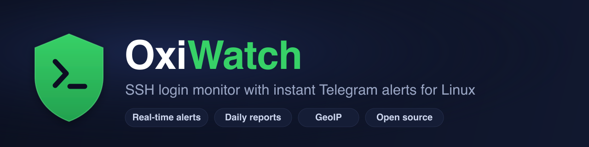

<div align="center">



# OxiWatch

### SSH login monitor with instant Telegram, Matrix and email alerts for Linux servers

Know the moment someone logs into your server over SSH, and get a daily report of every brute-force attempt that didn't get in.

[](https://github.com/oxisoft/oxiwatch/actions/workflows/ci.yml)
[](https://github.com/oxisoft/oxiwatch/actions/workflows/ci.yml)
[](https://github.com/oxisoft/oxiwatch/releases)
[](LICENSE)
[](go.mod)
[](#requirements)

**[Website](https://oxiwatch.oxisoft.io) · [Install](#quick-install) · [Configuration](#configuration) · [FAQ](#faq)**

</div>

---

OxiWatch is a lightweight, self-hosted SSH login monitor for Debian and Ubuntu servers. It watches the systemd journal in real time and sends an instant notification (via Telegram, Matrix, or email) every time someone logs in over SSH. Each morning it sends a report of the failed login attempts from the day before: who tried, how often, and where they came from (GeoIP). It's an easy way to keep an eye on brute-force activity.

It's a single Go binary, runs as a systemd service, stores history in SQLite, and needs nothing more than a Telegram bot, a Matrix room, or an SMTP account to start alerting. Enable as many channels as you like.

<div align="center">

</div>

## Table of contents

- [Why OxiWatch](#why-oxiwatch)
- [Features](#features)
- [OxiWatch and fail2ban](#oxiwatch-and-fail2ban)
- [Requirements](#requirements)
- [Quick install](#quick-install)
- [Upgrading](#upgrading)
- [Install from source](#install-from-source)
- [Configuration](#configuration)
- [Usage](#usage)
- [GeoIP setup](#geoip-setup)
- [Telegram bot setup](#telegram-bot-setup)
- [Matrix setup](#matrix-setup)
- [Email setup](#email-setup)
- [Prometheus metrics](#prometheus-metrics)
- [FAQ](#faq)
- [About](#about)

## Why OxiWatch

If you run a Linux server exposed to the internet, SSH is constantly probed. Most of the time you only find out something happened when you go digging through `journalctl` or `/var/log/auth.log` after the fact. OxiWatch flips that around: it tells you *as it happens*.

Use OxiWatch to:

- **Get an alert the instant someone logs in over SSH**, via Telegram, Matrix, or email, with the username, source IP, and country.
- **Choose your notification channel:** Telegram, a Matrix room, email, or several at once.
- **Monitor SSH logins across one or many Linux servers** from a single chat, room, or inbox.
- **Catch SSH brute-force attacks** with a daily summary of failed login attempts and your top attackers.
- **See where login attempts come from** with built-in GeoIP geolocation (no API key required).
- **Keep an audit trail** of successful logins in a local SQLite database with configurable retention.
- **Replace fragile log-tailing scripts** with one maintained binary that survives reboots and updates itself.

If you've ever searched for "*how to get a Telegram notification on SSH login*", "*monitor SSH logins on a Linux server*", or "*alert me when someone SSHes into my server*", that's exactly what OxiWatch does.

## Features

- **Real-time SSH login monitoring** via the systemd journal (`journalctl -u ssh`)
- **Instant alerts via Telegram, Matrix, or email** for every successful SSH login (enable one or several channels)
- **Daily reports of failed login attempts** with top attacker IPs and counts
- **GeoIP geolocation** of source IPs (optional, DB-IP Lite, no registration or license key)
- **SQLite storage** with configurable retention
- **systemd integration:** runs as a service, starts on boot
- **Self-upgrade** from GitHub releases (`oxiwatch upgrade`)
- **Single static binary**, no runtime dependencies
- Works on **Debian, Ubuntu, and other Debian-based** distributions

## OxiWatch and fail2ban

**OxiWatch is not a replacement for [fail2ban](https://github.com/fail2ban/fail2ban). It complements it, and the two run fine on the same machine.**

| | fail2ban | OxiWatch |
|---|---|---|
| Role | **Prevention:** bans IPs after repeated failures | **Visibility:** alerts you to logins and summarizes attacks |
| Acts on | Failed attempts (firewall bans) | Successful logins (instant alert) + failed attempts (daily report) |
| Notifies you | Not out of the box | Telegram, Matrix or email, in real time |
| Tells you *who got in* | No | Yes |

fail2ban blocks the brute-forcers; OxiWatch tells you the moment an authorized (or unauthorized) user actually gets a shell, and gives you the morning rundown of what was thrown at the box. Run both: fail2ban keeps attackers out, OxiWatch keeps you informed.

## Requirements

- Linux with **systemd** (tested on Debian 12/13; works on Ubuntu and other Debian-based systems)
- At least one notification channel: a **Telegram bot token and chat ID** ([setup below](#telegram-bot-setup)), a **Matrix homeserver/room/access token**, and/or an **SMTP account** for email
- Go 1.25+ *(only if building from source)*

## Quick install

Run the following command to install OxiWatch:

```bash
curl -sSL https://raw.githubusercontent.com/oxisoft/oxiwatch/main/scripts/install.sh | sudo bash
```

**If you get a "Cannot read from terminal" error**, download and run separately:

```bash
curl -sSL https://raw.githubusercontent.com/oxisoft/oxiwatch/main/scripts/install.sh -o /tmp/install.sh
sudo bash /tmp/install.sh
```

The installer will:

- Download the latest release for your architecture
- Walk you through each notification channel (Telegram, Matrix, email) and prompt for the ones you choose to enable
- Ask if you want GeoIP geolocation enabled
- Ask whether to expose Prometheus metrics and on which address
- Create the configuration file
- Install and enable the systemd service

After installation, check the service status:

```bash
sudo systemctl status oxiwatch
```

## Upgrading

After the initial installation, OxiWatch can upgrade itself to the latest release:

```bash
sudo oxiwatch upgrade
sudo systemctl restart oxiwatch
```

Daily reports will notify you when a new version is available.

## Install from source

```bash
# Build
make build

# Install binary and create directories
sudo make install

# Create config file
sudo cp /etc/oxiwatch/config.json.example /etc/oxiwatch/config.json
sudo nano /etc/oxiwatch/config.json

# Install and enable systemd service
sudo make install-service
sudo systemctl enable oxiwatch
sudo systemctl start oxiwatch
```

## Configuration

A full example with every option is in [`docs/config.json.example`](docs/config.json.example)
(also installed to `/etc/oxiwatch/config.json.example`).

Create `/etc/oxiwatch/config.json`:

```json
{
  "telegram_bot_token": "123456:ABC...",
  "telegram_chat_id": "-100123...",
  "server_name": "",
  "timezone": "Europe/Zurich",
  "geoip_enabled": true,
  "geoip_database_path": "/var/lib/oxiwatch/dbip-city-lite.mmdb",
  "database_path": "/var/lib/oxiwatch/oxiwatch.db",
  "daily_report_enabled": true,
  "daily_report_time": "08:00",
  "daily_report_timezone": "UTC",
  "retention_days": 90,
  "log_level": "info"
}
```

### Notification channels

OxiWatch delivers the same information (login alerts, daily reports, startup/shutdown
notices) to one or more channels. **At least one channel must be active**, or the
daemon refuses to start. A channel becomes active once all of its fields are set; configure
as many as you like.

Each channel can be toggled with a `*_enabled` flag (`telegram_enabled`, `matrix_enabled`,
`email_enabled`) **without clearing its credentials**. Set it to `false` to pause a channel
and `true` (or remove the flag) to resume it. When the flag is omitted, a fully configured
channel is enabled by default.

```json
{
  "telegram_bot_token": "123456:ABC...",
  "telegram_chat_id": "-100123...",

  "matrix_homeserver": "https://chat.example.ch",
  "matrix_room_id": "!roomid:chat.example.ch",
  "matrix_access_token": "syt_...",

  "email_smtp_url": "smtp://mail.example.ch:587",
  "email_from": "report@example.ch",
  "email_to": ["alerts@example.ch"],
  "email_username": "report@example.ch",
  "email_password": "secret"
}
```

- **Telegram:** bot API, HTML-formatted messages.
- **Matrix:** posts to the room via the client-server API (`m.room.message`), with both a
  plain-text `body` and an HTML `formatted_body`.
- **Email:** HTML mail over SMTP with STARTTLS on the submission port (587 by default).
  `email_to` is a list and may contain several recipients.

### Configuration options

| Option | Description | Default |
|--------|-------------|---------|
| `telegram_enabled` | Toggle Telegram without clearing credentials | true (when configured) |
| `telegram_bot_token` | Telegram bot token | - |
| `telegram_chat_id` | Telegram chat ID | - |
| `matrix_enabled` | Toggle Matrix without clearing credentials | true (when configured) |
| `matrix_homeserver` | Matrix homeserver URL (e.g. `https://chat.example.ch`) | - |
| `matrix_room_id` | Matrix room ID (e.g. `!abc:chat.example.ch`) | - |
| `matrix_access_token` | Matrix access token | - |
| `email_enabled` | Toggle Email without clearing credentials | true (when configured) |
| `email_smtp_url` | SMTP URL (e.g. `smtp://mail.example.ch:587`) | - |
| `email_from` | Sender address | - |
| `email_to` | List of recipient addresses | - |
| `email_username` | SMTP auth username | - |
| `email_password` | SMTP auth password | - |
| `server_name` | Server name for notifications | hostname |
| `timezone` | IANA timezone for notification timestamps (e.g. `Europe/Zurich`). UTC is shown in brackets alongside it | UTC |
| `geoip_enabled` | Enable GeoIP lookup | true |
| `geoip_database_path` | Path to DB-IP database | /var/lib/oxiwatch/dbip-city-lite.mmdb |
| `database_path` | Path to SQLite database | /var/lib/oxiwatch/oxiwatch.db |
| `daily_report_enabled` | Enable daily reports | true |
| `daily_report_time` | Time to send daily report | 08:00 |
| `daily_report_timezone` | Timezone for daily report | UTC |
| `retention_days` | Days to keep records | 90 |
| `log_level` | Log level (debug, info, warn, error) | info |
| `metrics_enabled` | Expose a Prometheus `/metrics` endpoint | false |
| `metrics_listen` | Address the metrics endpoint binds to | 127.0.0.1:9184 |

All options can be overridden via environment variables with the `OXIWATCH_` prefix (e.g., `OXIWATCH_TELEGRAM_BOT_TOKEN`).

## Usage

```bash
# Run daemon in foreground
oxiwatch daemon -f

# Show today's statistics
oxiwatch stats today

# Generate report for last 7 days
oxiwatch stats report -d 7

# Show successful logins
oxiwatch stats logins -d 30

# Update GeoIP database
oxiwatch geoip update

# Show GeoIP database status
oxiwatch geoip status

# Troubleshoot location detection for a specific IP (verbose)
oxiwatch geoip lookup 8.8.8.8

# Run retention cleanup manually
oxiwatch cleanup

# Validate configuration
oxiwatch config validate

# Show active configuration (secrets masked)
oxiwatch config show

# Send test Telegram message
oxiwatch send-test

# Self-upgrade to latest release
sudo oxiwatch upgrade

# Show version
oxiwatch version
```

## GeoIP setup

OxiWatch uses the **DB-IP Lite** database for IP geolocation. No registration or license key is required.

The database is downloaded automatically on first run and updated monthly (on the last day of each month).

To manually update the database:

```bash
oxiwatch geoip update
```

To check the database status:

```bash
oxiwatch geoip status
```

To troubleshoot why a specific IP has no location, run a verbose lookup. It
prints the database path/size/build date, whether the database opens, and the
full decoded record:

```bash
oxiwatch geoip lookup 83.6.42.41
```

If this reports that the database failed to open (corrupt/truncated), re-download
it with `sudo oxiwatch geoip update` and restart the service.

## Telegram bot setup

1. Create a bot with [@BotFather](https://t.me/BotFather)
2. Get your chat ID (send a message to [@userinfobot](https://t.me/userinfobot))
3. Add the bot token and chat ID to your config (`telegram_bot_token`, `telegram_chat_id`)
4. Test with `oxiwatch send-test`

## Matrix setup

OxiWatch posts to a Matrix room using the client-server API, so it works with any
homeserver (Synapse, Dendrite, a hosted server, etc.).

1. Create (or pick) a room and invite the account OxiWatch will post as.
2. Get the **room ID**. In Element: *Room settings → Advanced → Internal room ID* (looks like `!abcd1234:your.server`).
3. Get an **access token** for the posting account. In Element: *Settings → Help & About → Advanced → Access Token*, or log in via the API:
   ```bash
   curl -XPOST 'https://your.server/_matrix/client/r0/login' \
     --data '{"type":"m.login.password","user":"oxiwatch","password":"..."}'
   ```
4. Add `matrix_homeserver` (e.g. `https://your.server`), `matrix_room_id`, and `matrix_access_token` to your config.
5. Test with `oxiwatch send-test`.

> Access tokens don't expire until you log the session out, so keep the token secret and avoid logging out that session from another client.

## Email setup

OxiWatch sends HTML email over SMTP with STARTTLS on the submission port (587 by default).

1. Use an account that can send mail (a mailbox or relay account on your provider).
2. Add the email fields to your config:
   - `email_smtp_url`: e.g. `smtp://mail.example.ch:587`
   - `email_from`: sender address
   - `email_to`: list of recipients, e.g. `["alerts@example.ch"]`
   - `email_username` / `email_password`: SMTP authentication
3. Test with `oxiwatch send-test`.

> Tip: keep `/etc/oxiwatch/config.json` readable only where needed, since it holds the SMTP password. Set permissions with `chmod 600` if you store credentials there.

## Prometheus metrics

OxiWatch can expose its SSH activity as Prometheus metrics. Enable it in the config:

```json
{
  "metrics_enabled": true,
  "metrics_listen": "127.0.0.1:9184"
}
```

This serves an HTTP `/metrics` endpoint. Every `oxiwatch_*` series carries a constant
`server` label (taken from `server_name`), so a single Prometheus can scrape many hosts
and tell them apart.

| Metric | Type | Labels | Meaning |
|--------|------|--------|---------|
| `oxiwatch_ssh_login_attempts_total` | counter | `server`, `result`, `method` | SSH auth attempts (`result` = success/failure) |
| `oxiwatch_ssh_invalid_user_attempts_total` | counter | `server` | Attempts for non-existent users |
| `oxiwatch_ssh_attempts_by_country_total` | counter | `server`, `country` | Attempts by source country (GeoIP) |
| `oxiwatch_build_info` | gauge | `server`, `version` | Running version (value is always 1) |
| `oxiwatch_start_time_seconds` | gauge | `server` | Daemon start time (Unix seconds) |

> **Security:** the endpoint is unauthenticated. Keep it bound to `127.0.0.1` (or a private
> interface) and scrape it over a trusted network or behind a reverse proxy. Don't expose it
> to the internet. By convention, **usernames and source IPs are deliberately *not* metric
> labels** to avoid Prometheus cardinality blow-up; that detail lives in the SQLite history.

Example Prometheus scrape config:

```yaml
scrape_configs:
  - job_name: oxiwatch
    static_configs:
      - targets: ["server-1.example.ch:9184", "server-2.example.ch:9184"]
```

A ready-to-import **Grafana dashboard** is provided at
[`docs/grafana-dashboard.json`](docs/grafana-dashboard.json). Import it in Grafana and pick
your Prometheus data source.

## FAQ

### How do I get a Telegram notification when someone logs into my server over SSH?

Install OxiWatch, point it at a Telegram bot, and it sends an instant message on every successful SSH login, including the username, source IP, and country. See [Quick install](#quick-install).

### Can I get SSH alerts on Matrix or by email instead of Telegram?

Yes. OxiWatch supports Telegram, Matrix, and email as notification channels, and you can enable any combination of them. Every active channel receives the same alerts and daily reports. See [Matrix setup](#matrix-setup) and [Email setup](#email-setup).

### Can I send notifications to more than one channel at once?

Yes. Configure as many channels as you like; each one gets the full set of notifications. A channel can be paused at any time with its `*_enabled` flag without deleting its credentials. At least one channel must be active or the daemon won't start.

### Does OxiWatch replace fail2ban?

No. fail2ban *blocks* repeated failed attempts; OxiWatch *tells you* who actually logged in and gives you a daily summary of attacks. They solve different problems and run together on the same machine. See [OxiWatch and fail2ban](#oxiwatch-and-fail2ban).

### Which Linux distributions are supported?

Any Debian-based distribution with systemd. It's tested on Debian 12 and 13 and works on Ubuntu and derivatives. SSH events are read from the systemd journal, so a `journald`-based system is required.

### Does it work with OpenSSH 10.0+?

Yes. OxiWatch tracks the `sshd`, `sshd-session`, and `sshd-auth` syslog identifiers, so successful logins and failed attempts are captured on newer OpenSSH releases as well.

### How does OxiWatch detect SSH logins?

It reads the systemd journal in real time (`journalctl -u ssh`) and parses sshd authentication messages. No log files to tail, no PAM hooks to install.

### Is a GeoIP API key required?

No. OxiWatch uses the free DB-IP Lite database and downloads/updates it automatically. No account, key, or license is needed.

### Does it monitor failed SSH login attempts too?

Yes. Failed attempts (including invalid users and pre-auth disconnects) are recorded and summarized in a daily Telegram report with the top attacker IPs.

### Can I monitor multiple servers in one Telegram chat?

Yes. Install OxiWatch on each server and point them at the same chat. Set `server_name` so each alert is clearly labeled.

### Where is login history stored?

In a local SQLite database (`/var/lib/oxiwatch/oxiwatch.db` by default) with configurable retention via `retention_days`.

### Is OxiWatch free and open source?

Yes, it's MIT licensed. See the [LICENSE](LICENSE).

## About

Developed by [OxiSoft](https://oxisoft.io). We build backend systems with Go and Rust, and cross-platform apps with Flutter.

## License

[MIT](LICENSE)
